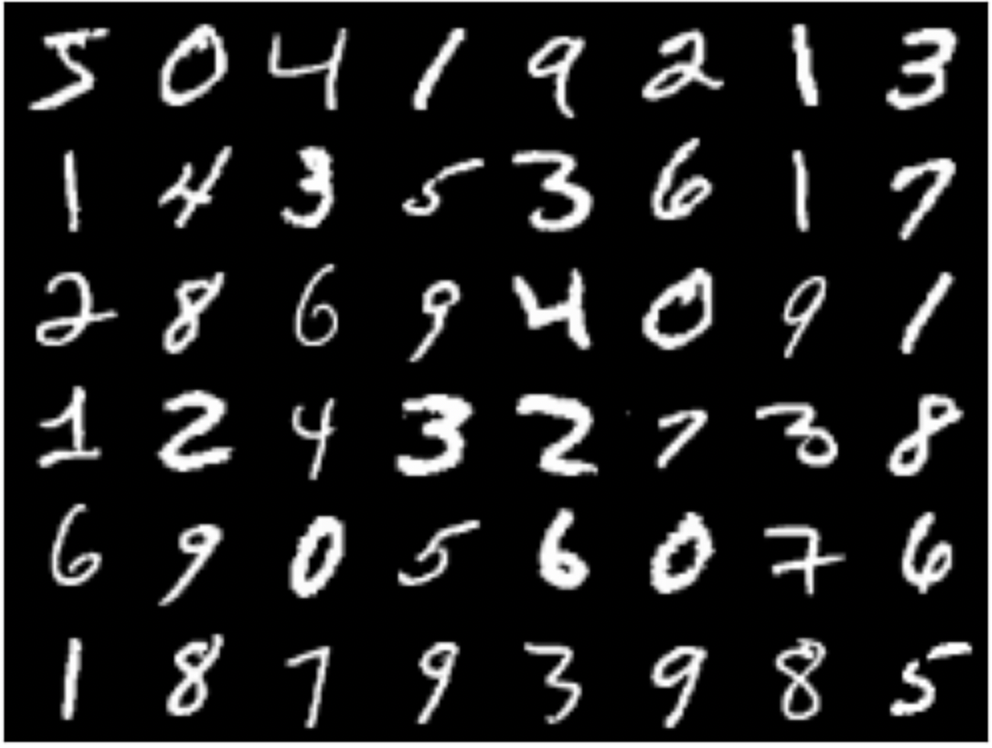
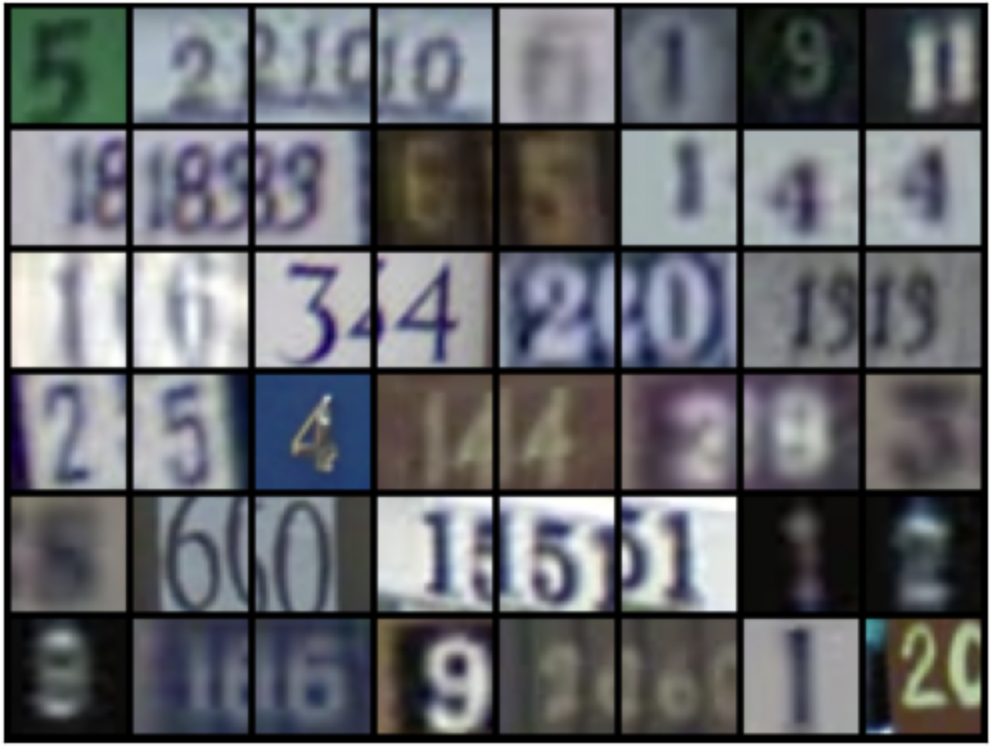
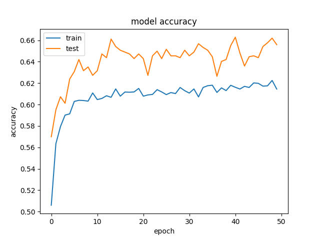

# IF5171 Deep Learning for Visual Recognition -- Week 7

Pada praktikum kali ini, teman-teman akan bermain-main dengan [PyTorch](https://pytorch.org) untuk mengimplementasikan deep neural nets dalam menyelesaikan permasalahan visual recognition. 
Bagi yang belum familiar dengan PyTorch disarankan mempelajari konsep dasarnya dengan mengikuti [tutorial berikut](https://pytorch.org/tutorials/).

## Main Dependencies

-- *Skip this part if your working environment has been ready* --

Apabila Anda mengerjakannya di PC/laptop masing-masing, pastikan working environment nya memiliki tools / libraries sebagai berikut:
- [Python 3.x.x](https://www.python.org/)
- [Pytorch](https://pytorch.org/) incl. torchvision
- [Jupyter Lab atau Jupyter Notebook](https://jupyter.org/)

## Warming Up
Contoh *source code* yang sudah didiskusikan di kelas terkait pemanfaatan Pytorch untuk membangun model rekognisi MNIST handwritten digit dapat dilihat pada folder [`src`](https://github.com/ghif/IF5171/tree/main/deeplearning/src).
Silakan dipelajari dan dijalankan sebagai *getting started* jika dibutuhkan.

## Project #1: Transfer My Digit (Bobot: 70%)

Seringkali kita dihadapkan pada situasi dimana __source data__ (sumber data untuk melatih model ML) dengan __target data__ (tempat dimana model ML tersebut diaplikasikan) memiliki kondisi yang berbeda, walaupun mencoba untuk mengerjakan *task* yang sama.
Pada konteks *visual recognition*, misalnya, 2 gambar yang memiliki objek yang sama boleh jadi memiliki "penampakan" atau variasi yang berbeda: warna, sudut pandang (*viewpoint*), corak (*style*), deformasi bentuk, dan sebagainya.
Terdapat istilah khusus yang menggambarkan kondisi tersebut, yaitu *dataset bias* [(Khosla et al. ECCV 2012)](https://people.csail.mit.edu/khosla/papers/eccv2012_khosla.pdf).

	  
	 

MNIST and SVHN Digits

Kita mencoba untuk mensimulasikan situasi di atas dengan menggunakan 2 dataset handwritten digit: __MNIST__ dan __SVHN__.
Anda diminta untuk melakukan beberapa percobaan pada situasi sebagai berikut:

***
### In-Domain Recognition
*In-domain recognition* merupakan standar konfigurasi *training-test* dengan menggunakan dataset yang sama. 
Situasi ini mengasumsikan *training data* dan *test data* memiliki kondisi / distribusi yang tidak jauh berbeda.

Lakukanlah percobaan ML dengan setting-an berikut:

1. __MNIST-to-MNIST__.

Training dan test data keduanya berasal dari dataset MNIST (*MNIST train* --> *MNIST test*).

2. __SVHN-to-SVHN__.

Training dan test data keduanya berasal dari dataset SVHN (*SVHN train* --> *SVHN test*).

### Cross-Domain Recognition
*Cross-domain recognition* merupakan situasi yang menggambarkan *dataset bias*, dimana *training data* berasal dari sumber yang berbeda dengan *test data*.

Lakukanlah percobaan ML dengan setting-an berikut:

3. __SVHN-to-MNIST__.

Training data diambil dari SVHN, namun test data diambil dari MNIST (*SVHN train* --> *MNIST test*)

4. __MNIST-to-SVHN__.

Training data diambil dari MNIST, namun test data diambil dari SVHN (*MNIST train* --> *SVHN test*)
***

Pada masing-masing percobaan di atas, lakukanlah dengan model multilayer perceptrons (MLP) dan convolutional neural networks (ConvNet).
Dengan demikian ada total __8 percobaan__ yang perlu Anda lakukan.

Anda dipersilakan berkreasi dalam melakukan manipulasi data/gambar (*grayscaling*, *resizing*, dsb) dan juga mengatur konfigurasi model *deep learning*, mencakup jumlah dan ukuran layer, pemilihan activation function, algoritma optimisasi, *hyper-parameter setting (learning rate, batch size)*, dan sebagainya, yang menurut Anda dapat memberikan akurasi yang terbaik dari tiap-tiap percobaan.

*Deliverables* yang dikumpulkan (Format: [NIM]-[NAMALENGKAP]-IF5171-DL-1.zip) 
- 8 *main training script* (ipynb) yang mengimplementasikan masing-masing percobaan.
- 8 grafik/*line chart* (png/jpg) yang menggambarkan *progress* akurasi terhadap waktu/*epoch*: sumbu x menunjukkan *epoch*, sumbu y menggambarkan skor akurasi. Contoh:

<!--  -->

Skor evaluasi pekerjaan yang Anda lakukan mempertimbangkan hal-hal sebagai berikut:
1. (__90 poin__) Keterselesaian percobaan yang ditunjukkan dengan kelengkapan 8 *main training scripts* (*runnable without errors*) + 8 *line charts*:
	- MNIST-to-MNIST (__15 poin__)
	- SVHN-to-SVHN (__15 poin__)
	- SVHN-to-MNIST (__30 poin__)
	- MNIST-to-SVHN (__30 poin__)

2. (Bonus: __10 poin__) 1 percobaan tambahan untuk MNIST-to-SVHN: meningkatkan akurasi dari percobaan *baseline* yang Anda lakukan sebelumnya dengan memanfaatkan kombinasi dari metode *data augmentation*, *dropout regularization*, dan *batch normalization*.

## Project #2: Transfer My Deep Learning for Recognizing Everything (Bobot: 30%)

Pada tahun 2012, *deep learning* berhasil mencapai *breakthrough* yang mampu memenangkan perlombaan sebagai model terbaik untuk problem klasifikasi objek visual pada dataset ImageNet, dimana model [AlexNet](https://papers.nips.cc/paper/2012/hash/c399862d3b9d6b76c8436e924a68c45b-Abstract.html) menjadi pemenang. 
Setelah itu, bermunculanlah berbagai model *deep learning* seperti AlexNet dengan arsitektur yang lebih kompleks, e.g., GoogleNet, VGGNet, ResNet, XCeption, dan sebagainya.

Model-model *deep learning* seperti yang disebutkan dapat diistilahkan dengan __backbone net__. Mengapa demikian?
Karena ada temuan yang cukup fenomenal terkait model-model tersebut, yaitu dapat dimanfaatkan sebagai *backbone* untuk melakukan pekerjaan-pekerjaan lainnya terkait *computer vision* antara lain *object classification*, *detection*, *segmentation*, dan sebagainya.
Dengan kata lain, *backbone net* yang sudah dilatih pada dataset ImageNet, yang terdiri dari 1000 kelas objek dengan total \~1.2 juta sampel data, memiliki sifat *transferable*!

https://pytorch.org/tutorials/beginner/transfer_learning_tutorial.html

.....

## Submission
1. Dua (2) files yang di-submit via platform Edunex:
	- Project #1: __[NIM]-[NAMALENGKAP]-IF5171-DL-1.zip__
	- Project #2: __[NIM]-[NAMALENGKAP]-IF5171-DL-2.zip__
2. Deadline: __[Day], [Date] Oktober 2022, pukul 23:59 WIB__