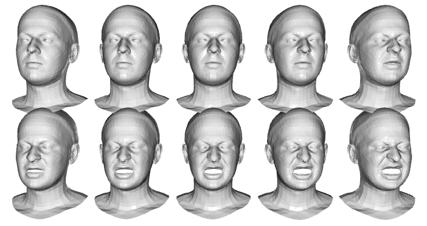

# IF5171 Unsupervised Learning and Generative Model

Pada modul belajar mandiri ini, mari kita bermain-main dengan dunia 3D!

Di dunia CGI/VFX atau game, salah satu pekerjaan besar yang perlu dilakukan adalah membuat model karakter 3D yang bisa dikontrol pergerakannya dan dianimasikan. 
Dalam konteks model wajah 3D, suatu ekspresi wajah biasanya dihubungkan dengan sebuah parameter yang bisa dikontrol sehingga animator dapat memanipulasi ekspresi sesuai yang diinginkan.
Kita dapat membangun sebuah model wajah 3D dengan membentuk kumpulan __ekspresi basis__ beserta parameter terkait, dimana rentang ekspresi dari wajah tersebut terwakili dengan kombinasi dari ekspresi basis.
Jika kombinasi tersebut merupakan kombinasi linear, maka model wajah tersebut disebut dengan [*face blendshapes*](https://diglib.eg.org/bitstream/handle/10.2312/egst.20141042.199-218/199-218.pdf?sequence=1&isAllowed=y), yang sangat populer penggunaannya di industri film.

Ekspresi-ekspresi basis biasanya dibuat secara manual oleh ahli permodelan wajah 3D, dikenal dengan istilah *sculpting*.
Proses manual ini bisa memakan waktu yang lama -- untuk membuat karakter Gollum pada film *Lord of The Rings* dibutuhkan 964 ekspresi basis!

Pada praktikum ini kita mencoba untuk membuat model wajah dari *3D mesh* secara otomatis dengan memanfaatkan *unsupervised learning* dalam konteks *generative model*.
Dataset *3D mesh* dalam format [Polygon File (.ply)](https://en.wikipedia.org/wiki/PLY_(file_format)) yang merepresentasikan seorang aktor dapat diunduh di [sini](https://1drv.ms/u/s!AgX5GEtworUahVDpJ7QDWgl4hgx6?e=DB29YD).
Data tersebut merupakan sebagian sampel dataset yang dipakai pada [CoMA (Convolutional Mesh Autoencoders)](https://coma.is.tue.mpg.de/).

Beberapa pekerjaan yang perlu Anda lakukan adalah sebagai berikut:
1. Visualisasikan data 3D mesh original minimal 10 wajah (__x poin__).
	Contoh:

2. Bentuk / latih model wajah 3D secara *unsupervised* dengan menggunakan:
	a. PCA (__x poin__)
	b. Autoencoder (__x poin__)
3. 

...
